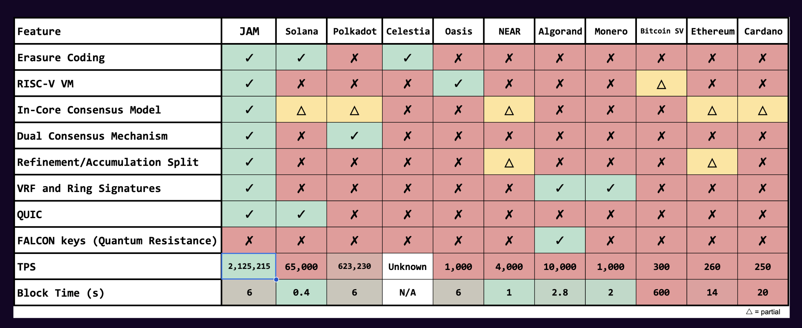

This repository is a personal learning resource to aid my complete understanding of the [JAM grey paper](https://graypaper.com/graypaper.pdf)

## Definitions

## Sets

### General
$ \mathbb{Y} $: the set of octet strings (byte arrays) of arbitrary length. $\mathbb{Y}_{n}$ denotes the subset of byte arrays of length $n$.

$ \mathbb{H} $: the set of 256-bit (32-byte) values expected to be arrived at through a cryptographic function (equivalent to $\mathbb{Y}_{32}$) .

### Cryptographic Sets

**ED25519**
- $ \mathbb{E}_k  \langle m \rangle \subset \mathbb{Y}_{64}$ : set of valid Ed25519 signatures made through knowledge of a secret key whose public key counterpart is $k$, and who's message is $m$

- $ \mathbb{H}_E \subset \mathbb{Y}_{32}$ : set of valid Ed25519 public keys

**BLS**
- $ \mathbb{Y}_{BLS} \subset \mathbb{Y}_{144} $ : set of public keys for the BLS signature scheme

**Bandersnatch**
- $ \mathbb{H}_B \subset \mathbb{Y}_{32} $ : set of valid Bandersnatch public keys
- $ \mathbb{F}^{m \in \mathbb{Y}}_{k \in \mathbb{H}_B} \langle x \in \mathbb{Y}\rangle \subset\ \mathbb{Y}_{96}$ : the set of valid singly-contextualized signatures of utilizing the secret counterpart to the public key k, some context $x$ and message $m$.
- $\mathbb{Y}_R \subset \mathbb{Y}_{144}$ : the set of valid Bandersnatch roots
- $\overline{\mathbb{F}}^{m \in \mathbb{Y}}_{k \in \mathbb{Y}_R} \langle x \in \mathbb{Y}\rangle \subset\ \mathbb{Y}_{784}$ : the set of valid Bandersnatch RingVRF deterministic singly-contextualized proofs of knowledge of a secret within some set of secrets identified by some root in the set of valid *roots* $\mathbb{Y}_R$.

### Jam Datastructure Sets
$\mathbb{C}$: the set of *tickets*, which is a tuple of a verifiably random ticket identifier (a hash) and the ticket's entry-index (a number)

$\mathbb{K}$: set of validator key tuples

## Functions

#### Cryptography functions
$\mathcal{H}(m \in \mathbb{Y}) \to \mathbb{H}$ : [Blake2b](https://www.rfc-editor.org/info/rfc7693) 256-bit hash function

$\mathcal{H}_K(m \in \mathbb{Y}) \to \mathbb{H}$ : [Keccak](https://keccak.team) 256-bit hash function

$\mathcal{M}_{\sigma}(\sigma)$ : state-Merklization function, transforms our state $\sigma$ into a 32-octet commitment

#### Serialization
$\mathcal{E}(x \in \mathbb{T}) \to \mathbb{Y}$ : serialization codec transforms some $x$ into an octet sequence, where $\mathbb{T}$ is some generic set. An octet sequence yields an identity transform.

$\mathcal{E}^{-1}(x \in \mathbb{Y}) \to \mathbb{T}$ : decoder function

$\mathcal{E}_{U}(\bold{H}) \to \mathbb{Y}$ : serialization codec specific to the block header that does not include the header's ***block seal***. To include the block seal in serialization simply $\mathcal{E}(\bold{H})$ is used.

#### Blockchain
$ P(\bold{H})$ : mapping from one block header to its parent block header

$\mathcal{T}$ : gives time relative to the *JAM Common Era*, **12:00 UTC January 1, 2025**

## General Notation
...

### Resources
- [JAM grey paper](https://graypaper.com/graypaper.pdf)
- [ELVES paper](https://eprint.iacr.org/2024/961)
- [Advice slides #1](https://polkadot-blockchain-academy.github.io/pba-content/current/syllabus/6-Polkadot/15-JAM-how-to-start-slides.html#/)
- [Advice slides #2](https://polkadot-blockchain-academy.github.io/pba-content/current/syllabus/6-Polkadot/14-jam-math-to-code-slides.html#/)

### Diagrams

